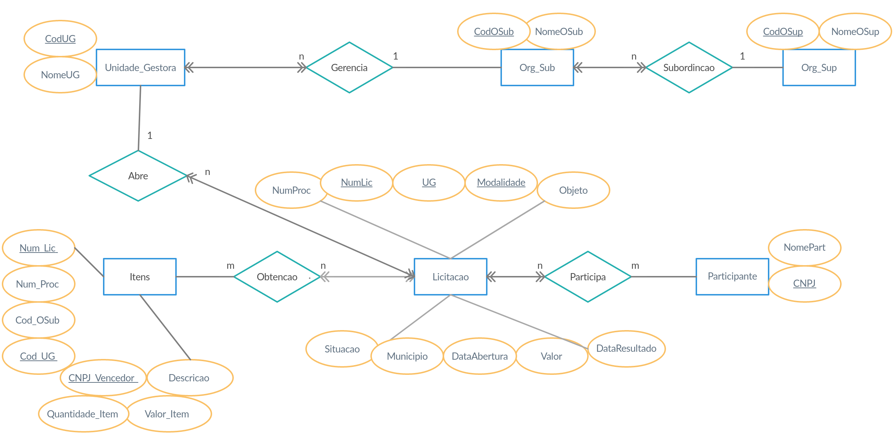

# Banco de Dados de Licitações

|-------------|-----------------------------------------------------------------------|
| Data        | 10/2020                                                               |
| Colaboração | Grupo                                                                 |
| Disciplina  | Introdução a Bancos de Dados, UFMG                                    |
| Professor   | [Rodrygo Luis Teodoro Santos](http://lattes.cnpq.br/1162362624079364) |
| Tecnologias | Python, Jupyter Notebook, SQLite, Numpy, Pandas                       |

[Assista ao vídeo da apresentação!](https://www.youtube.com/watch?v=Kt4Wm4tGM44&feature=youtu.be)

---

O objetivo deste trabalho foi projetar e implementar um banco de dados relacional para análise de dados abertos governamentais. Seguimos um processo bottom-up, iniciado a partir da análise de um conjunto de dados de Licitações, referentes ao mês de janeiro de 2020, extraídos do DW-SIASG e publicados no Portal da Transparência do Governo Federal.

>**Licitação**(Número Licitação, Número Processo, Objeto, Modalidade Compra, Situação Licitação, Código Órgão Superior, Nome Órgão Superior 	Código Órgão, Nome Órgão, Código UG, Nome UG, Município, Data Resultado Compra, Data Abertura, Valor Licitação)
>
>**ItensLicitação**(Número Licitação, Número Processo, Código Órgão, Nome Órgão, Código UG, Nome UG, CNPJ Vencedor, Nome Vencedor, Descrição, Quantidade Item, Valor Item)
>
>**ParticipantesLicitação**(Número Licitação, Número Processo, Código Órgão, Nome Órgão, Código UG, Nome UG, Código Item Compra, Descrição Item Compra, CNPJ Participante, Nome Participante)

_Esquema Relacional original dos dados_

Originalmente, os dados estavam distribuídos em três tabelas, cujo esquema relacional não estava normalizado, portanto foi necessário normaliza-lo para então mapeá-lo para o esquema Entidade-Relacionamento correspondente. O resultado possui sete tabelas. Usando a biblioteca SQLite, criamos o banco de dados em seu formato original, além das tabelas vazias correspondentes ao nosso esquema, e então as preenchemos usando consultas de seleção a partir do banco original.

_Esquema Entidade-Relacionamento resultante_

Por fim, realizamos diversas consultas SQL, envolvendo operações de seleção, projeção, junção de duas ou mais relações e funções de agregação. Por exemplo, identificamos que o órgão superior encarregado do maior número de unidades gestoras é o Ministério da Educação, cujas licitações têm um custo médio de R$ 414.592,09 .

    SELECT Nome_OSup
    FROM (Orgao_Sup 
        NATURAL JOIN Orgao_Sub 
        NATURAL JOIN Unidade_Gestora)
    GROUP BY Cod_OSup
    ORDER BY COUNT(*) DESC
    LIMIT 1

_Consulta para encontrar o órgão superior com mais unidades gestoras_

    SELECT AVG(Valor_Licitacao)
    FROM (Licitacao 
        NATURAL JOIN Unidade_Gestora 
        NATURAL JOIN Orgao_Sub 
        NATURAL JOIN Orgao_Sup)
    WHERE Nome_OSup = 'Ministério da Educação'

_Consulta para calcular o custo médio das licitações do Ministério da Educação_

*[DW-SIASG]: Data Warehouse do Sistema Integrado de Administração de Serviços Gerais

---

[Acesse o Notebook com o código!](https://github.com/helenapato/helenapato.github.io/blob/main/projetos/licitacoes/TP2_IBD_Notebook.ipynb)