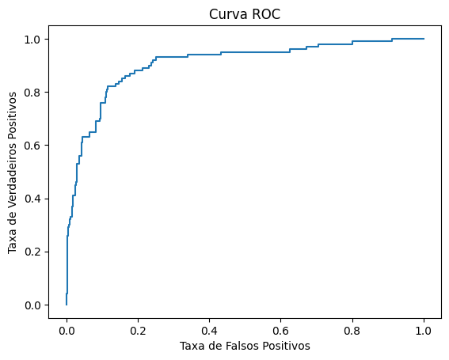

# Rotatividade de Clientes

|-------------|-------------------------------------------------------------------------------------------------------------------------------|
| Data        | 01/2024                                                                                                                       |
| Colaboração | Individual                                                                                                                    |
| Curso       | [Spark and Python for Big Data with PySpark](https://www.udemy.com/course/spark-and-python-for-big-data-with-pyspark/), Udemy |
| Instrutor   | [Jose Portilla](https://www.udemy.com/user/joseportilla/)                                                                     |
| Tecnologias | Python, Jupyter Notebook, PySpark, Matplotlib                                                                                 |

Uma empresa tem notado uma grande rotatividade de clientes que usam seus serviços. Atualmente, eles atribuem gerentes de contas aleatoriamente para seus consumidores. Porém, eles gostariam de usar dados históricos para prever quais clientes irão deixar a empresa, e focar os gerentes nessas pessoas.

O material da companhia inclui desde informações demográficas, como nome e idade do comprador, até informações sobre o serviço prestado, como o total de compras e a data de aquisição do cliente. Particularmente, essa data incluía dia, hora, minuto e segundo, detalhes que não pareciam relevantes. Portanto, foram descartadas, mantendo-se apenas o ano e mês de aquisição do freguês.

|              Names| Age|Total_Purchase|Account_Manager|Years|Churn|
|-------------------|----|--------------|---------------|-----|-----|
|   Cameron Williams|42.0|       11066.8|              0| 7.22|    1|
|      Kevin Mueller|41.0|      11916.22|              0|  6.5|    1|
|        Eric Lozano|38.0|      12884.75|              0| 6.67|    1|
|      Phillip White|42.0|       8010.76|              0| 6.71|    1|
|     Cynthia Norton|37.0|       9191.58|              0| 5.56|    1|

_Exemplo de Atributos representados pelo conjunto de dados_

Após essa transformação, os dados rotulados entre clientes que deixaram o serviço, e os que não o fizeram, foram separados em conjuntos de treino e teste, em uma proporção de 7:3. O fato de haver apenas dois rótulos faz com que esse seja um caso de classificação binária, dessa forma foi escolhido um modelo de regressão logística para a predição.

Os dados de treino foram alimentados ao modelo, e após seu treinamento, ele foi avaliado usando os dados de teste. Foi obtida uma área de 0.72 abaixo da curva ROC. Como uma área de 1.0 indica um encaixe perfeito dos dados, quanto mais próxima desse valor, melhor a predição. Em outras palavras, a taxa de verdadeiros positivos foi bem maior do que a taxa de falsos positivos e o modelo teve um bom desempenho.

Por fim, foram geradas previsões para dados de clientes cujo rótulo não era conhecido, demonstrando que o modelo está apto para ser usado em dados não vistos.

|         Names|prediction|
|--------------|----------|
| Andrew Mccall|       0.0|
|Michele Wright|       1.0|
|  Jeremy Chang|       1.0|
|Megan Ferguson|       1.0|
|  Taylor Young|       0.0|
| Jessica Drake|       1.0|

_Predições geradas para novos clientes_

---

[Acesse o Notebook com o código!](https://github.com/helenapato/helenapato.github.io/blob/main/projetos/rotatividade_clientes/Logistic_Regression_Consulting_Project.ipynb)