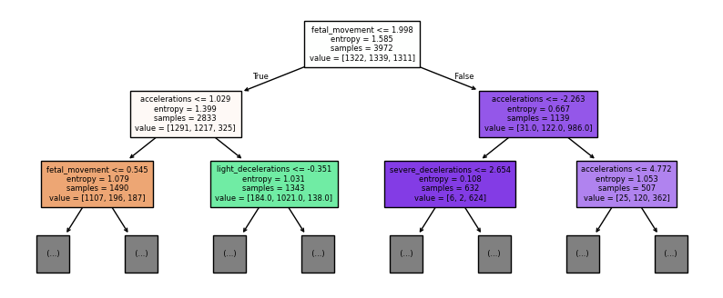

# Classificação de Saúde Fetal

|-------------|----------------------------------------------------------------------|
| Data        | 11/2022                                                              |
| Colaboração | Individual                                                           |
| Disciplina  | Mineração de Dados, UFMG                                             |
| Professor   | [Wagner Meira Jr.](http://lattes.cnpq.br/9092587237114334)           |
| Tecnologias | Python, Numpy, Pandas, Matplotlib, Scikit Learn, Google Colaboratory |

A mortalidade infantil é um importante indicador de saúde e qualidade de vida. Dado que grande parte dos óbitos ocorrem em situações de poucos recursos, a cardiotocografia (CTG) é um exame simples e acessível para avaliar a saúde fetal. A análise de seus resultados permite que profissionais da saúde ajam para prevenir a mortalidade infantil e materna. 

A partir de dados de 2126 exames CTG, em que a saúde fetal foi categorizada em três classes: normal, suspeita e patológica, será criado um classificador que preveja o estado de saúde da criança. Dessa forma, contribui-se para a atuação dos profissionais de saúde e para a prevenção da mortalidade infantil.

Inicialmente, foi feita uma exploração dos dados, que permitiu definir procedimentos para adequá-los a um algoritmo de classificação. Nessa etapa, constatou-se que as classes estavam desbalanceadas, o que gerou uma oportunidade de fazer experimentos com diferentes tipos de métodos de balanceamento. Também experimentamos variar o modelo usado, alterando entre florestas aleatórias e árvores de decisão.

_Início da árvore de decisão resultante_

O modelo final escolhido foi uma árvore de decisão treinada com oversampling, que atingiu **0.82** de acurácia média por validação cruzada no treinamento e gerou uma matriz de confusão com poucas classificações errôneas. Ele 
também foi capaz de generalizar bem para dados não vistos, atingindo uma acurácia média de **0.86** na validação cruzada usando os dados de teste.

_Matriz de confusão gerada no treinamento_

Dessa forma, o modelo está apto a atuar em seu propósito inicial, de ajudar a prever a condição de saúde fetal. Principalmente devido ao baixo número de casos de saúde patológica sendo classificados como normal ou suspeita, já que os falsos negativos são mais perigosos nesse cenário.

*[CTG]: Cardiotocografia

---

[Leia o relatório completo!](saude_fetal/TP3_Relatorio_Helena_Pato.pdf)

---

[Acesse o Notebook com o código original!](https://github.com/helenapato/helenapato.github.io/blob/main/projetos/saude_fetal/tp3-classificacao.ipynb)