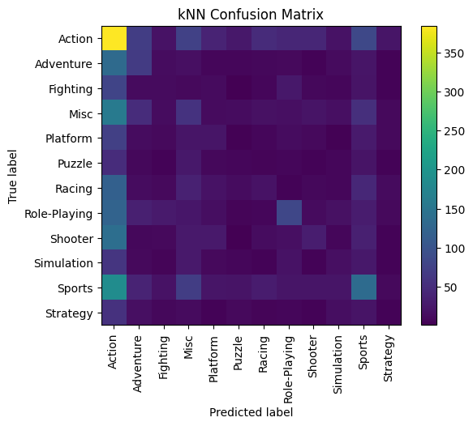

# Videogames - Qualidade versus Popularidade

|-------------|-------------------------------------------------------------------------------|
| Data        | 06/2019                                                                       |
| Colaboração | Dupla                                                                         |
| Disciplina  | Introdução a Ciência de Dados, UFMG                                           |
| Professor   | [Flávio Vinícius Diniz de Figueiredo](http://lattes.cnpq.br/9481210393304645) |
| Tecnologias | Python, Jupyter Notebook, Matplotlib, Numpy, Scikit Learn, Pandas             |

[Assista ao vídeo da apresentação!](https://www.youtube.com/watch?v=8a3kgH6a2Ms&feature=youtu.be)

---

O embate entre a popularidade e a qualidade de um produto midiático interessa aqueles que o consomem. É sempre bom ouvir que seu filme favorito é bom, enquanto uma nota baixa da crítica deixa os fãs contrariados. Porém, muitos trabalhos independem da opinião de um especialista para ganharem o coração do público. Os Video Games não são uma exceção. Enquanto jogos avaliados como obras primas por críticos costumam fazer sucesso, existem também os que são considerados medíocres e mesmo assim vendem milhões pelo mundo.

Outro aspecto que influencia no êxito comercial de um Video Game é seu gênero. Os jogos violentos normalmente são o centro das atenções, mas existem vários outros que fazem sucesso no mercado. O que nos leva a uma reflexão em relação ao público consumidor de um determinado gênero de entretenimento, já que tudo isso influencia na formação do jogador.

Para analisar essas relações, utilizamos uma base de dados sobre Video Games que venderam pelo menos 10 mil cópias, entre 1980 e 2016, gerada a partir do site VGChartz. A caracterização inicial dos dados evidenciou que menos da metade dos jogos possuía avaliação no site Metacritic. Além disso, observamos que os jogos de ação são os mais contemplados pelo conjunto de dados.

Usamos um modelo de regressão linear simples para relacionar a avaliação dos críticos às vendas globais. O RMSE resultante foi de 1.6, um valor significativo, considerando que as vendas estão na escala dos milhões. Já o R² foi de 0.09, um valor muito próximo de zero, reforçando a ideia de que o modelo não explica a variação dos dados. Como resultado, nossa função de regressão ficou com uma inclinação diferente daquela representada pelos pontos.

Porém, um teste de hipótese por permutação indicou que a pontuação de um jogo tem, sim, uma relação com seu sucesso comercial. Ao olharmos para os jogos que tem uma classificação ruim, constatamos que eles vendem pouco. Porém, a grande quantidade de jogos bem classificados que não venderam não pode ser ignorada.

Já para medir como o gênero influencia nas vendas ao redor do mundo, utilizamos um classificador kNN, que tenta prever a qual gênero (classe) pertence o jogo, de acordo com suas vendas em cada região geográfica. A primeira tentativa gerou resultados ruins e, ao desenhar uma matriz de confusão, percebemos que muitos jogos de outros gêneros estavam sendo classificados como de ação.

_Matriz de confusão do classificador kNN inicial_

Para contornarmos esse problema, fizemos uma amostragem com reposição dos jogos, equilibrando o número de instâncias de cada gênero. Essa abordagem gerou resultados melhores e foi possível, por exemplo, contrastar a popularidade de jogos de ação na América do Norte, com a de jogos de RPG no Japão. Usando outro teste de hipótese, concluímos que esses dois aspectos são sim, correlacionados e serviram para a classificação realizada.

*[RMSE]: Raiz do Erro Quadrático Médio

---

[Acesse o Notebook com o código!](https://github.com/helenapato/helenapato.github.io/blob/main/projetos/videogames/NotebookProjetoFinalVideoGames.ipynb)